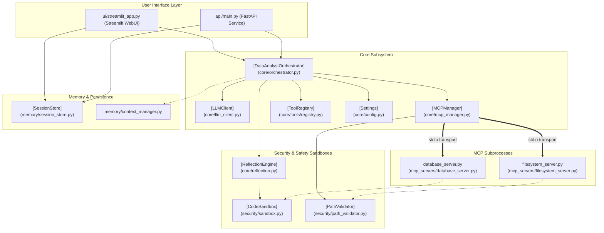

# Data Analyst MCP Platform: System Architecture & Data Flow

This document details the architecture, design patterns, core subsystems, data models, and request flows of the **Data Analyst MCP Platform**. It serves as a comprehensive developer reference for understanding how components coordinate to provide a secure, observability-instrumented, and resilient data-analyst agent.

---

## 1. System Overview & Platform Design

The Data Analyst Platform is an autonomous, agentic system designed to ingest, query, analyze, and visualize data. It leverages a natural language interface backed by a Large Language Model (Groq) and coordinates operations via the **Model Context Protocol (MCP)** alongside traditional host-side tools.

### Key Architectural Tenets
1. **Separation of Concerns**: High-level orchestrators run asynchronously in a FastAPI service layer or a Streamlit UI, delegating discrete system actions (database queries, filesystem access) to dedicated sandboxed MCP subprocesses.
2. **Defensive Safety Gates**: Every generated code snippet (SQL or Python) undergoes deterministic static analysis (AST parsing) before passing through a LLM critique loop (Reflection) and entering execution.
3. **Resilience & Governance**: Remote network operations and subprocess calls feature strict timeout budgets, circuit breakers, exponential backoff, and token window trimming.
4. **Zero-Trust Tooling**: Data ingestion and profiling are executed entirely locally (no LLM text leakage), and all tool outputs are treated as untrusted payload context.

### Two-Generation Coexistence
The codebase preserves both a **Gen 1 (Prototype)** and a **Gen 2 (Production-Grade)** implementation:
- **Gen 1 (Prototype)**: Found in root files [agents.py](file:///c:/VSCode/All%20my%20projects/data-analyst-mcp/data-analyst-mcp/agents.py), [reflection.py](file:///c:/VSCode/All%20my%20projects/data-analyst-mcp/data-analyst-mcp/reflection.py), and [app.py](file:///c:/VSCode/All%20my%20projects/data-analyst-mcp/data-analyst-mcp/app.py). These components run synchronously, lack sandbox verification, and connect to unhardened servers like [sqlite_server.py](file:///c:/VSCode/All%20my%20projects/data-analyst-mcp/data-analyst-mcp/mcp_servers/sqlite_server.py).
- **Gen 2 (Production)**: The primary architecture documented below, composed of modules inside `core/`, `security/`, `observability/`, `memory/`, `ingestion/`, `api/`, and `ui/`.

---

## 2. Block Architecture Diagram

The diagram below represents the modular layout of the Gen 2 platform, tracing the boundary between user interfaces, the core orchestration layer, the safety sandboxes, and the MCP servers:



---

## 3. Core Subsystem Walkthrough

### 3.1. Configuration Subsystem
- **Module**: [config.py](file:///c:/VSCode/All%20my%20projects/data-analyst-mcp/data-analyst-mcp/core/config.py)
- **Key Class**: [Settings](file:///c:/VSCode/All%20my%20projects/data-analyst-mcp/data-analyst-mcp/core/config.py#L44)
- **Purpose**: Implements Pydantic v2 `BaseSettings` for type-safe environment resolution (prioritizing system environment variables, `.env` configurations, and defaults). Enforces validation rules on core constraints, such as file extension allowlists and cap limits on database query returns.

### 3.2. Resilient LLM client
- **Module**: [llm_client.py](file:///c:/VSCode/All%20my%20projects/data-analyst-mcp/data-analyst-mcp/core/llm_client.py)
- **Key Class**: [LLMClient](file:///c:/VSCode/All%20my%20projects/data-analyst-mcp/data-analyst-mcp/core/llm_client.py#L108)
- **Purpose**: Wraps the Groq SDK. Exposes async execution by running blocking Groq calls in a thread executor, protecting the event loop. Integrates an internal **Circuit Breaker** state machine (with Closed, Open, Half-Open states) to halt traffic upon detection of provider downtime. Handles exponential backoff with randomized jitter for transient errors and records token usage in telemetry.

### 3.3. Persistent MCP Manager
- **Module**: [mcp_manager.py](file:///c:/VSCode/All%20my%20projects/data-analyst-mcp/data-analyst-mcp/core/mcp_manager.py)
- **Key Class**: [MCPManager](file:///c:/VSCode/All%20my%20projects/data-analyst-mcp/data-analyst-mcp/core/mcp_manager.py#L51)
- **Purpose**: Spawns and manages long-lived stdio subprocess sessions using Python's `AsyncExitStack`. DISCOVERS tool capability schemas at startup, maps tool names to their parent processes, and dynamically executes client calls. Includes support for connection health pings, automated reconnection, and clean teardowns.

### 3.4. Static & Dynamic Safety Sandboxes
- **Module**: [sandbox.py](file:///c:/VSCode/All%20my%20projects/data-analyst-mcp/data-analyst-mcp/security/sandbox.py) & [path_validator.py](file:///c:/VSCode/All%20my%20projects/data-analyst-mcp/data-analyst-mcp/security/path_validator.py)
- **Key Classes**: [CodeSandbox](file:///c:/VSCode/All%20my%20projects/data-analyst-mcp/data-analyst-mcp/security/sandbox.py#L150) & [PathValidator](file:///c:/VSCode/All%20my%20projects/data-analyst-mcp/data-analyst-mcp/security/path_validator.py#L31)
- **Purpose**:
  - `CodeSandbox` performs AST parsing on Python code to block modules (e.g. `os`, `sys`, `subprocess`, socket networking), dangerous built-ins (e.g. `eval`, `exec`), and restricted functions. For SQL queries, it performs syntactic pattern audits to restrict multi-statement blocks (splitting by semicolons) and write keywords (e.g. `DROP`, `DELETE`, `UPDATE`), preventing injection exploits.
  - `PathValidator` enforces structural filesystem isolation via `Path.is_relative_to()`. It rejects absolute paths pointing outside configured storage targets (`data/` and `outputs/`) and prevents symlink escape vectors.

### 3.5. Multi-Format Ingestion
- **Module**: [processor.py](file:///c:/VSCode/All%20my%20projects/data-analyst-mcp/data-analyst-mcp/ingestion/processor.py)
- **Key Function**: [ingest_file](file:///c:/VSCode/All%20my%20projects/data-analyst-mcp/data-analyst-mcp/ingestion/processor.py#L62)
- **Purpose**: Profiles uploaded files locally using native libraries. Supports tabular files (CSV, Excel sheets, JSON, Parquet, Feather), document parsing (PDF, XML), and image OCR text extraction (Tesseract/EasyOCR fallback). Generates summary statistics and structural schema previews while isolating raw file content from the LLM prompt.

### 3.6. Memory and Persistence Subsystem
- **Module**: [session_store.py](file:///c:/VSCode/All%20my%20projects/data-analyst-mcp/data-analyst-mcp/memory/session_store.py) & [context_manager.py](file:///c:/VSCode/All%20my%20projects/data-analyst-mcp/data-analyst-mcp/memory/context_manager.py)
- **Key Class**: [SessionStore](file:///c:/VSCode/All%20my%20projects/data-analyst-mcp/data-analyst-mcp/memory/session_store.py#L33)
- **Purpose**: 
  - `SessionStore` leverages an SQLite database (`.sessions.db`) to persist state records (e.g. active schemas, queries list, business context) across page refreshes or API restarts.
  - `context_manager.py` manages token overhead (calculated using a `1 token ≈ 4 characters` heuristic). It handles message window trimming (preserving system instructions and recent context while shedding intermediate logs) and structures summarization.

---

## 4. End-to-End Execution Flow

When a user submits a query (e.g., *"What is the average salary by department in sample.csv?"*), the platform coordinates steps through the system using the following request flow:

```mermaid
sequenceDiagram
    autonumber
    actor User as User Interface
    participant Orch as DataAnalystOrchestrator
    participant Store as SessionStore
    participant LLM as LLMClient
    participant Ref as ReflectionEngine
    participant Box as CodeSandbox
    participant MCP as MCPManager
    participant Tool as ToolRegistry

    User->>Orch: run(query, session_id)
    Note over Orch: Generate Correlation ID & Start Timer
    
    Orch->>Store: get_or_create(session_id)
    Store-->>Orch: SessionContext (memory_summary, schemas)
    
    Note over Orch: Compile SYSTEM_PROMPT + Session Context
    
    rect rgb(240, 240, 255)
        Note over Orch, LLM: Reasoning Loop (Up to max_tool_iterations)
        Orch->>LLM: chat_completion(messages, tools)
        LLM-->>Orch: ChatCompletion (tool_calls=[query_data(sql=...)])
        
        Note over Orch: Routing Decision: Is MCP tool? Yes (query_data)
        
        rect rgb(255, 240, 240)
            Note over Orch, Box: Safety Gate for SQL Code
            Orch->>Ref: reflect_on_sql(sql_query)
            Ref->>Box: validate_sql_readonly(sql_query)
            Note over Box: AST checks: Block semicolons & mutating keywords
            Box-->>Ref: Approved / Safe
            
            Ref->>LLM: Critique loop (Review correctness, performance, limit clause)
            LLM-->>Ref: ReflectionVerdict (approved=True, risk_level=low)
            Ref-->>Orch: ReflectionResult (final_code="SELECT avg(salary) FROM ...")
        end
        
        Orch->>MCP: call_tool("query_data", {"sql": "..."})
        MCP->>MCP: Resolve server target (database)
        MCP->>MCP: Execute stdio process request
        MCP-->>Orch: Tool Result (JSON string)
        
        Note over Orch: Truncate tool response if it exceeds max_context_tokens
        Note over Orch: Add response back to message history
    end

    Orch->>LLM: chat_completion(messages) [Final Synthesis]
    LLM-->>Orch: ChatCompletion (content="The average salary is...")
    
    Orch->>Store: save(SessionContext)
    Orch-->>User: QueryResult (result, tool_calls, reflection_log, latency)
```

---

## 5. Domain Models Directory

The canonical data schemas are defined in [models.py](file:///c:/VSCode/All%20my%20projects/data-analyst-mcp/data-analyst-mcp/core/models.py). The critical models are highlighted below:

### 5.1. QueryResult
The payload object returned by the orchestrator at the end of the query lifecycle.
```python
class QueryResult(BaseModel):
    query: str                       # Original user query
    result: str                      # Final synthesized response
    tool_calls: list[ToolCallRecord] # Every tool invoked during execution
    reflection_log: list[ReflectionCycleEntry]  # Log of safety reviews
    error: str | None                # Primary execution error if any
    session_id: str                  # Session identifier
    correlation_id: str              # Log tracing correlation key
    total_tokens_used: int           # LLM token count
    total_latency_ms: float          # End-to-end latency
    timestamp: datetime              # Timestamp of completion
```

### 5.2. SessionContext
Stores persistent conversational state.
```python
class SessionContext(BaseModel):
    session_id: str                  # Primary session key
    created_at: datetime             # Session initialization timestamp
    updated_at: datetime             # Session update timestamp
    user_goal: str                   # Identified query goal
    data_schemas: list[dict[str, Any]] # Active schemas in session context
    previous_queries: list[str]      # Queue of prior queries
    generated_files: list[str]       # Created paths tracking
    business_context: str            # Custom metadata
    total_queries: int               # Cumulative metrics counter
    memory_summary: str              # Summarized context injected to prompt
```

### 5.3. ReflectionVerdict
Output from the Reflection LLM reviewing generated code.
```python
class ReflectionVerdict(BaseModel):
    approved: bool                   # Pass/Fail review status
    risk_level: RiskLevel            # LOW, MEDIUM, or HIGH risk tag
    issues: list[str]                # Array of issues identified
    corrected_code: str              # Cleaned/Rewritten code recommendation
    explanation: str                 # Justification explanation
```

### 5.4. IngestionResult
The metadata package returned by the local ingestion processor.
```python
class IngestionResult(BaseModel):
    filename: str                    # Ingested file name
    file_category: FileCategory      # TABULAR, DOCUMENT, IMAGE, or UNKNOWN
    file_size_bytes: int             # File size
    row_count: int | None            # Row counts (if tabular)
    column_count: int | None         # Column counts (if tabular)
    columns: list[ColumnProfile]     # Detailed statistical schema profile
    preview_rows: list[dict[str, Any]] # First N preview records
    text_content: str | None         # Extracted document/image text
    quality_warnings: list[str]      # Data issues (e.g. duplicates, null count)
    processing_time_ms: float        # Processing latency
```

---

## 6. Observability & Telemetry

Observability spans three distinct layers configured within `observability/`:
1. **Structured Log Stream**: Driven by [logger.py](file:///c:/VSCode/All%20my%20projects/data-analyst-mcp/data-analyst-mcp/observability/logger.py). In console mode, logs are formatted for readability; in production, logs output as JSON strings containing `correlation_id` and `session_id` tracing tags.
2. **Telemetry Counters**: [metrics.py](file:///c:/VSCode/All%20my%20projects/data-analyst-mcp/data-analyst-mcp/observability/metrics.py) tracks metrics (e.g. `queries_total`, `llm_latency_ms`, `mcp_tool_errors_total`) in thread-safe buckets accessible via `/metrics`.
3. **Trace Instrumentation**: [tracing.py](file:///c:/VSCode/All%20my%20projects/data-analyst-mcp/data-analyst-mcp/observability/tracing.py) provides a trace interface using OpenTelemetry wrappers, falling back to a dummy no-op interface if SDK packages are missing.
